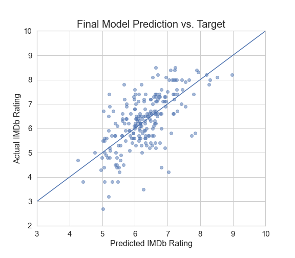

<a name="readme-top"></a>

<!-- PROJECT LOGO -->
<br />
<div align="center">
  <a href="https://github.com/monicahirin/Monica.git">
    
  </a>

  <h3 align="center">IMDB Score Prediction</h3>

  <p align="center">
"Elevate your movie analytics with IMDb Score Prediction. This GitHub project utilizes machine learning to forecast IMDb ratings, providing a glimpse into the potential success of films. Unlock the predictive power of data and enhance your understanding of audience preferences."
  </p>
</div>


<!-- TABLE OF CONTENTS -->
<details>
  <summary>Table of Contents</summary>
  <ol>
    <li>
      <a href="#about-the-project">About The Project</a>
      <ul>
        <li><a href="#built-with">Built With</a></li>
      </ul>
    </li>
    <li>
      <a href="#getting-started">Getting Started</a>
      <ul>
        <li><a href="#prerequisites">Prerequisites</a></li>
        <li><a href="#installation">Installation</a></li>
      </ul>
    </li>
    <li><a href="#usage">Usage</a></li>
    <li><a href="#roadmap">Roadmap</a></li>
    <li><a href="#contributing">Contributing</a></li>
    <li><a href="#license">License</a></li>
    <li><a href="#contact">Contact</a></li>
    <li><a href="#acknowledgments">Acknowledgments</a></li>
  </ol>
</details>


<!-- ABOUT THE PROJECT -->
## About The Project
Our project is about IMDb Score Prediction, a captivating exploration into the fusion of machine learning and film analytics. Through sophisticated algorithms, we aim to forecast IMDb ratings for movies, offering valuable insights into potential audience reception. Delving into historical data and critical features, our project provides a data-driven perspective on predicting the success of films. Whether you're a cinephile, data scientist, or developer, join us in unraveling the mysteries of predictive modeling at the crossroads of data and cinema. Explore, contribute, and embrace the future of movie analytics in our collaborative GitHub repository.
<div align="center">

</div>

<p align="right">(<a href="#readme-top">back to top</a>)</p>


### Built With

This section should list any major frameworks/libraries used to bootstrap your project. Leave any add-ons/plugins for the acknowledgements section. Here are a few examples.

* Python
* Jupyter Notebook

<p align="right">(<a href="#readme-top">back to top</a>)</p>


<!-- GETTING STARTED -->
## Getting Started
To get started with our stock prediction project, follow these steps:

1. Clone the repository to your local machine.
2. Install the required Python dependencies as specified in the README, and you're ready to begin exploring and utilizing the stock prediction model.
### Prerequisites
 Ensure you have Python 3.x installed and the necessary libraries, such as NumPy, Pandas, and TensorFlow, are set up according to the provided instructions in the README before running the stock prediction models.
* Install the requirements.txt file 
   ```sh
   pip install -r requirements.txt
   ```

### Installation

 Here's a self-contained installation guide for our app, eliminating the need for external dependencies or services.

1. Clone the repository to your local machine:
   ```sh
   https://github.com/monicahirin/Monica.git
   ```
2. Navigate to the project directory:
   ```sh
   cd Monica
   ```
3. Run the Jupyter Notebook File (imdbscoreprediction.ipynb).
   
4.In your web browser, navigate to the notebook file and open it.

5.Follow the instructions in the Jupyter Notebook to train the LSTM model, make predictions, and evaluate its performance.

6.You can also visualize model predictions and explore usage examples within the Jupyter Notebook.

<p align="right">(<a href="#readme-top">back to top</a>)</p>


<!-- USAGE EXAMPLES -->
## Usage
1. Loading and Pre-processing data
2. Training and Testing data
3. Model testing and Displaying Output

<p align="right">(<a href="#readme-top">back to top</a>)</p>


<!-- CONTRIBUTING -->
## Contributing

Contributions are what make the open source community such an amazing place to learn, inspire, and create. Any contributions you make are **greatly appreciated**.

If you have a suggestion that would make this better, please fork the repo and create a pull request. You can also simply open an issue with the tag "enhancement".
Don't forget to give the project a star! Thanks again!

1. Fork the Project
2. Create your Feature Branch (`git checkout -b feature/AmazingFeature`)
3. Commit your Changes (`git commit -m 'Add some AmazingFeature'`)
4. Push to the Branch (`git push origin feature/AmazingFeature`)
5. Open a Pull Request

<p align="right">(<a href="#readme-top">back to top</a>)</p>

<!-- CONTACT -->
## Contact

Project Link: [(https://github.com/monicahirin/Monica.git)](https://github.com/monicahirin/Monica.git)

<p align="right">(<a href="#readme-top">back to top</a>)</p>


<!-- ACKNOWLEDGMENTS -->
## Acknowledgments

We would like to express our gratitude to the following resources and individuals who have contributed to the success of this project
* [Kaggle](https://www.kaggle.com/)
* [AskPython](https://www.askpython.com/)
* [GeeksForGeeks](https://www.geeksforgeeks.org/)
* [GitHub Pages](https://pages.github.com)

<p align="right">(<a href="#readme-top">back to top</a>)</p>


[Python-url]: https://www.python.org/

